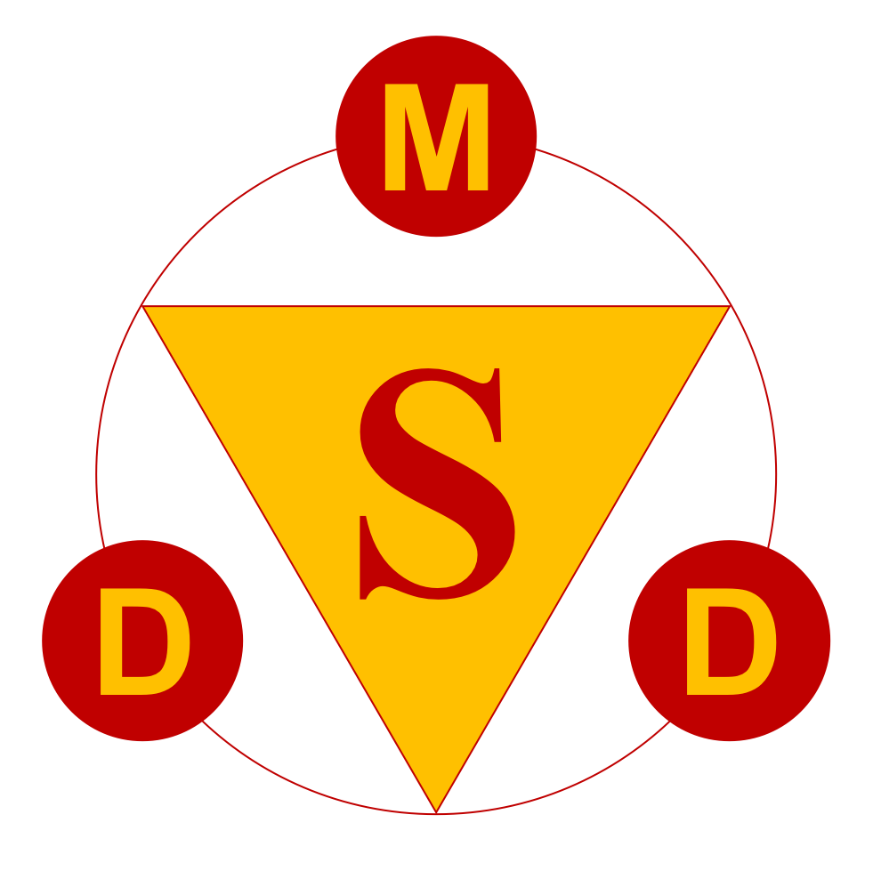

**sDMD** - *Version 0.93*
=====================================

## Discontinuous Molecular Dynamics (DMD) Simulation Package
## <br><br>

**Table of Contents**
=====================

+ [Introduction](#introduction)

+ [Units](#units)

+ [Models and Interactions](#models-and-interactions)

  + [Models](#models)

    + [Intermediate-resolution Coarse Grained Model](#intermediate-resolution-coarse-grained-model)

    + [High-resolution All-atom Model](#high-resolution-all-atom-model)

  + [Interactions](#interactions)

    + [Algorithms](#algorithms)

    + [Energy Minimization](#energy-minimization)

    + [Confined Walls](#confined-walls)

    + [Replica Exchange Molecular Dynamics Simulation (REMD)](#replica-exchange-molecular-dynamics-simulation-remd)

+ [Program Structure](#program-structure)

+ [Program Usage](#program-usage)

  + [Installation](#installation)

  + [Run Parameters](#run-parameters)

    + [Non-REMD simulation](#non-remd-simulation)

    + [REMD Simulation](#remd-simulation)

    + [Analysis](#analysis)

+ [Format](#format)

  + [Coordinate File](#coordinate-file)

    + [GRO File](#gro-file)

    + [PDB File](#pdb-file)

  + [Force Field File](#force-field-file)

    + [Parameters of amino acid](#parameters-of-amino-acid)

    + [Potential Table](#potential-table)

+ [Functions](#functions)

  + [Simulation Source Code](#simulation-source-code)

  + [DMD.c](#dmd.c)

  + [DataSave.c](#datasave.c)

  + [Event.c](#event.c)

  + [Initialization.c](#initialization.c)

  + [List.c](#list.c)

  + [Models.c](#models.c)

  + [REMD.c](#remd.c)

  + [SGThread.c](#sgthread.c)

  + [ThreadProcess.c](#threadprocess.c)

  + [TimePrediction.c](#timeprediction.c)

  + [ToolFunctions.c](#toolfunctions.c)

  + [sREMD.c](#sremd.c)

  + [sServer.c](#sserver.c)

+ [Analysis Source Code](#analysis-source-code)

  + [Analysis.c](#analysis.c)

  + [FileManage.c](#filemanage.c)

  + [SystemInformation.c](#systeminformation.c)

  + [Cluster.c](#cluster.c)

  + [Energy.c](#energy.c)

  + [HBRamach.c](#hbramach.c)

  + [PBCAdjust.c](#pbcadjust.c)

  + [REMD.c](#remd.c-1)

  + [Tools.c](#tools.c)

**Introduction**
================

Discrete molecular dynamics (DMD) simulation algorithm is an extremely
fast alternative to traditional molecular dynamics. It was first
introduced in 1959 by Alder and Wainwright<sup id="c11">[1](#c11)</sup>
for simulations of hard
spheres. Later it was used by Rapaport<sup id="c12">[2-4](#c12)</sup>
for simulation of polymer
chains. Nowadays it was adopted for simulations of protein-like
polymers. It is extremely fast and suitable for the simulations of large
systems on long time scales.


*Figure 1-1 DMD potential (a) hard sphere collision (b) attractive
square well interaction (c) repulsive soft sphere interaction (d)
covalent bond and auxiliary bond interaction*
<br><br>

During DMD simulation, potentials applied on particles are approximated
by discontinuous step-functions of inter-particle distance *r* (see
Figure *1-1*). Thus no forces will be exerted on particles until their
distance becomes equal to the point of a discontinuity on the potential.
When particle encounters a potential discontinuity, we call it have an
"event". Between events, particles move at constant velocities. Because
the energy change during each event is known, the post-event velocities
can be calculated by solving the conservation of momentum and the
conservation of energy simultaneously. Thus, the trajectory of a
particle can be simulated discontinuously between events. The simulation
code for DMD is significantly different than that for traditional
molecular dynamics because the particles are moved discontinuously from
one event to the next with known velocities.

Here we proudly introduce the sDMD, a simulation package based on the
DMD technique and a high-resolution all-atom molecular model. The
package is written by *C* language from scratch and has been highly
optimized. Its modularized structure has it be highly expandable: new
molecular groups can be introduced by simply adding new formatted
connection and potential data files, and no modification on the code
would be necessary. The package, including the simulation executable and
analysis executable, is also very easy to use: the configurations are
controlled by an easy-to-read configuration file and several command
flags.

Currently the package is capable to run simulations under various
situations as follows,

-   NVT and NVE ensembles

-   bulk conditions as well as parallel pores, cylindrical tubes and
    spherical cavities

-   replica exchange molecular dynamics simulation (REMD)

-   dynamic confined systems as the confined walls expand, compress and
    pulse.

-   molecule flow through a tube between two reservoirs

and the analysis executable can be used to analyze the following,

-   remove periodic boundary conditions of trajectory

-   compute the number of different types of hydrogen bonds

-   compute Ramachandran plot

-   compute system temperature, kinetic energy and potential energy

-   compute number of clusters during aggregation

-   analyze data from T-REMD by weighted histogram analysis method
    (WHAM)

This manual will describe the theories behind the DMD simulation, as
well as the models of molecules and algorithms of interactions applied
in the MD simulation. It will also describe the function of each file in
the source code and demonstrate the ways to install and use the package.

<br><br>
*Reference*

<b id="c11">[1]</b> Alder, B. J.; Wainwright, T. E., Studies in Molecular Dynamics. 
I.General Method. *The Journal of Chemical Physics* **1959,** *31* (2), 459-466.[↩](#c11)

<b id="c12">[2]</b> Rapaport, D. C., Molecular dynamics simulation of polymer
chains with excluded volume. *Journal of Physics A: Mathematical and
General* **1978,** *11* (8), L213.[↩](#c12)

<b id="c12">[3]</b> Rapaport, D. C., Molecular dynamics
study of a polymer chain in solution. *The Journal of Chemical Physics*
**1979,** *71* (8), 3299-3303.[↩](#c12)

<b id="c12">[4]</b> Rapaport, D., The event scheduling
problem in molecular dynamic simulation. *Journal of Computational
Physics* **1980,** *34* (2), 184-201.[↩](#c12)
<br><br><br>

**Units**
=========

*Table 2-1 Basic units*

**Quantity** | **Symbol** | **Unit**
---------- | -------- | ------
length     | L        | Å = 10<sup>-10</sup> m
mass       | m        | u (atomic mass unit) <br/>= 1.6605402(10) x 10<sup>-27</sup> kg <br/>(1/12 the mass of a <sup>12</sup>C atom)
energy     | E        | kcal mol<sup>-1</sup> <br/>= 4.184 kJ mol<sup>-1</sup> <br/>= 4184 m<sup>2</sup> kg s<sup>-1</sup> mol<sup>-1</sup>
<br>

*Table 2-2 Derived units*

**Quantity** | **Symbol** | **Unit**
---------- | -------- | ------
time       | T        | 50 fs = 50 x 10<sup>-15</sup> s
velocity   | V        | Å (50 fs)<sup>-1</sup> = 2 x 10<sup>3</sup> m s<sup>-1</sup>
temperature| T        | 503 K
force      | F        | u Å (50 fs)<sup>-2</sup> = 66.4 pN
<br>

*Table 2-3 Constants*

**Symbol** | **Name** | **Unit**
-------- | ------ | ------
*N<sub>A</sub>* | Avogadro's number | 6.0221367(36) x 10<sup>23</sup> mol<sup>-1</sup>
*k<sub>B</sub>* | Boltzmann's constant | 1.987204118 x 10<sup>-3</sup> kcal mol<sup>-1</sup> K<sup>-1</sup>
<br>

**Models and Interactions**
===========================

This section will describe the molecular models and interaction
algorithms that used in the sDMD.

**Models**
----------

Different protein models can be used in DMD ranging from high-resolution
all-atom model to low-resolution coarse-grained model. The latest
version of the sDMD only uses the high-resolution all-atom model. The
early version uses coarse grained model. Both models share a lot of
characteristics. Here will give a description of the models starting
from the low-resolution and then upgrade to the high-resolution.

### **Intermediate-resolution Coarse Grained Model**

In the early version, the sDMD uses an intermediate-resolution coarse
grained model, named PRIME, developed by Smith and Hall<sup id="c31">[1-4](#c31)</sup>. It
correctly reproduces the backbone geometry and has been highly
successful in reproducing several important and experimentally
determined features of the proteins under bulk conditions. In RPIME,
every amino acid is represented by four beads: N, C<sub>α</sub>, C, and R (see
*Figure 3-1*). The N bead represents the amide nitrogen and its
hydrogen; the C<sub>α</sub> bead represents the alpha-carbon and its hydrogen;
the C bead represents the carbonyl carbon and oxygen; the R bead
represent the side chain, all of which are assumed to have the same
diameter as CH<sub>3</sub> (alanine). The inter-peptide bond is assumed to be in
the *trans* configurations, all the backbone bonds' lengths and bond
angles are fixed at their experimentally measure values, and the
distance between consecutive C<sub>α</sub> bead is also fixed according to
experimental data. *Table 3-1* presents all the relevant parameters of
the model. Solvent molecules are not explicitly included in the model.
The effect of solvent is factored into the energy function as a
potential of mean force.

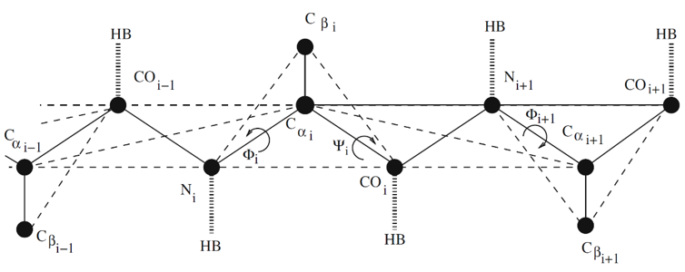

*Figure 3-1 The four-bead model of the protein backbone. Bold lines show
covalent bond, dashed lies show auxiliary bonds which helps maintain
correct backbone geometry, and thick broken lines show possible hydrogen
bonds.<sup id="c35">[5](#c35)</sup>*
<br><br>


*Table 3-1 Parameter values for the proteins used in the DMD
simulations*

**Beads** | **Diameter (Å)**
--------- | ----------------
N         | 3.300
C<sub>α</sub> | 3.700
C         | 4.000
R         | 4.408
<br>
                     
**Bonds** | **Length (Å)**
--------- | --------------
N<sub>i</sub>-C<sub>α,i</sub> | 1.460
C<sub>α,i</sub>-N<sub>i+1</sub> | 1.510
C<sub>i</sub>-N<sub>i+1</sub> | 1.330
C<sub>α,i</sub>-R<sub>i</sub> | 1.531
<br>
                          
**Auxiliary Bonds** | **Length (Å)**
------------------- | --------------
N<sub>i</sub>-C<sub>i</sub> | 2.450
C<sub>α,i</sub>-N<sub>i+1</sub> | 2.410
C<sub>i</sub>-C<sub>α,i+1</sub> | 2.450
C<sub>α,i</sub>-C<sub>α,i+1</sub> | 3.800
N<sub>i</sub>-R<sub>i</sub> | 2.440
C<sub>i</sub>-R<sub>i</sub> | 2.490
<br>
                          
**Bond Angles** | **Angle (deg)**
--------------- | ---------------
∠N<sub>i</sub>-C<sub>α,i</sub>-C<sub>i</sub> | 111.0
∠C<sub>α,i</sub>-C<sub>i</sub>-N<sub>i+1</sub> | 116.0
∠C<sub>i</sub>-N<sub>i+1</sub>-C<sub>α,i+1</sub> | 122.0
∠R<sub>i</sub>-C<sub>α,i</sub>-C<sub>i</sub> | 109.6
∠R<sub>i</sub>-C<sub>α,i</sub>-N<sub>i</sub> | 110.1
<br>

Beads in the protein are subject to five different types of forces
during events: (1) infinite repulsion due to excluded volume effect
(hard-sphere collision), (2) infinite attraction between the beads
connected with covalent bonds and auxiliary bonds, (3) attraction
between pairs of back-bone beads during hydrogen bond formation, (4)
attraction between hydrophobic side chains, and (5) repulsion between
the neighborhood beads of hydrogen bond (soft-sphere collision). All
these forces can be represented by the following step-functions,

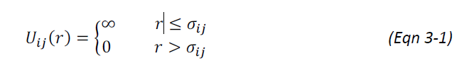

This is for a hard-sphere potential. *r* is the distance between beads
*i* and *j*; *sigma<sub>ij</sub>* is the sum of bead radius.

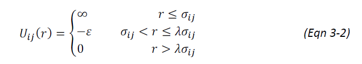

This is for a square-well or shoulder potential depending on the sign of
*epsilon* (positive for well depth, attractive; negative for
shoulder height, repulsive). *lammda_sigma<sub>ij</sub>* is the
well/shoulder diameter.

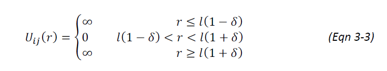

This is for a bond interaction. *l* is the bond length and *delta* is
the bond vibration tolerance.

Note that, as explained in the work by Takada et al,<sup id="c36">[6](#c36)</sup> interaction
involving a pair of beads that are very close on the chain are more
faithfully represented by an interaction between the atoms themselves,
not the united atoms or the coarse grained beads. In other words, for
example, neighboring carbonyl carbon atoms experience interactions based
on the diameter of a carbon atom, not on the diameter of the C bead.
Consequently, for interaction between pairs of beads that separated by
three or fewer bonds, the beads are allowed to overlap in their
simulations by up to 25% of their diameters; for those separated by four
bonds, they are allowed to overlap up to 15%.

Backbone beads and C<sub>α</sub> and R beads are connected by covalent bonds.
Bonds are allowed to move freely over a small range between
*l(1 - delta)* and *l(1 - delta)*. The
choice of *delta* defines the acceptable range of bond vibration. In
the simulation, *delta* is chosen to be 0.02375. Auxiliary bonds are
used between next-neighbor beads along the backbone of the chain to hold
backbone angles fixed. For example, an auxiliary is placed between N<sub>i</sub>
and C<sub>i</sub> in *Figure (3-1)* to force N<sub>i</sub>-C<sub>α,i</sub>-C<sub>i</sub> angle to be near
its ideal value. Auxiliary bonds are also included between neighboring
pairs of C<sub>α</sub> beads to maintain their distances near the experimentally
determined constant value. The combination of C<sub>α,i</sub>-N<sub>i+1</sub>,
C<sub>i</sub>-C<sub>α,i+1</sub>, and C<sub>α,i</sub>-C<sub>α,i+1</sub> auxiliary bonds and the C<sub>α,i</sub>-C<sub>i</sub>,
C<sub>i</sub>-N<sub>i+1</sub>, and N<sub>i+1</sub>-C<sub>α,i+1</sub> covalent bonds holds the inter-peptide
group (C<sub>α,i</sub>-C<sub>i</sub>-N<sub>i+1</sub>-C<sub>α,i+1</sub>) in the *trans* configuration.
Auxiliary bonds are also placed between side-chains and N and C beads on
backbone. This is to hold the side-chain beads fixed relative to the
backbone so that all model residues are *L*-isomers.

Hydrogen bond (HB) can be formed between N and C beads on backbones.
Four criteria have to be met (see *Figure 3-2*): (1) the distance
between N<sub>i</sub> and C<sub>j</sub> beads is 4.2 Å; (2) the neighbor beads, 
C<sub>i-1</sub> and
C<sub>α,i</sub>, C<sub>α,j</sub> and N<sub>j+1</sub>, are at appropriate positions; (3) neither N
nor C bead is already involved in a hydrogen bond; (4) N and C beads are
separated by at least three intervening residues or they are in
different peptides. To ensure that criteria (2) is satisfied, we require
that the four atom pairs N<sub>i</sub>-C<sub>α,j</sub>, 
N<sub>i</sub>-N<sub>j+1</sub>, C<sub>j</sub>-C<sub>α,i</sub>,
C<sub>j</sub>-C<sub>i-1</sub> shown in *Figure (3-2)* be separated by a distance greater
than *d<sub>ij</sub>*, which is chosen to maintain the hydrogen bond
angle constraints. Their values are given in *Table 3-2*.

When two beads N<sub>i</sub> and C<sub>j</sub> approach each other at the distance
*d<sub>ij</sub>* = 4.2 Å, we will evaluate the total
potential energy change by checking the four auxiliary interactions. The
potential energy change can be -*epsilon<sub>HB</sub>*, 
*0*, *epsilon<sub>HB</sub>*, 2*epsilon<sub>HB</sub>* and 3*epsilon<sub>HB</sub>*,
depending on the orientation of the
N<sub>i</sub>, C<sub>j</sub>, and their neighbors. If the kinetic energy is enough to
overcome the total potential energy change, the forward reaction will
happen. N<sub>i</sub> and C<sub>j</sub> beads will change their type into N<sub>i</sub>' and C<sub>j</sub>',
respectively, and interact with each other (the other interactions with
N<sub>i</sub> and C<sub>j</sub> will not be affected) according to the interaction
parameters related to their new types. Otherwise, the two atoms N<sub>i</sub> and
C<sub>j</sub> do not change their types and undergo original hard-sphere
collision. The thermal fluctuation distort the orientation of the
hydrogen bond and large fluctuations may break the hydrogen bond. Once
the two atoms N<sub>i</sub>' and C<sub>j</sub>' come again to the exact distance
*d<sub>ij</sub>* = 4.2 Å, a reverse reaction may
happen. We will check the potential energy change by using the similar
way we check in HB formation, and decide if the HB will break so that
N<sub>i</sub>' and C<sub>j</sub>' will change back to their original types, N<sub>i</sub> and C<sub>j</sub>,
respectively.

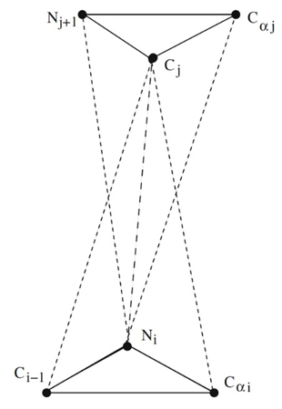

*Figure 3-2 Hydrogen bond structure of coarse grained model. Thick
dashed lines indicate hydrogen bond; thin dashed lines indicate
auxiliary bonds helping to maintain hydrogen bond orientation, and bold
lines show the covalent bonds of the backbone.*
<br><br>

*Table 3-2 Parameter values for hydrogen bond*

**Pairs** | ***d<sub>ij</sub>(Å)***
--------- | -------------
N<sub>i</sub>-C<sub>α,j</sub> | 5.00
N<sub>i</sub>-N<sub>j+1</sub> | 4.74
C<sub>j</sub>-C<sub>α,i</sub> | 4.86
C<sub>j</sub>-C<sub>i-1</sub> | 4.83
<br>

To maintain the temperature around the target value in NVT ensemble, we
implement Andersen thermostat.<sup id="c37">[7](#c37)</sup> With this procedure, all beads in the
simulation are subjected to random, infrequent collisions with ghost
particles having the same mass as themselves. The post-event velocity of
a bead colliding with a ghost particle is chosen randomly from a
Maxwell-Boltzmann distribution centered at the simulation temperature.
The collision frequency is controlled at 1% of the total events number.

The solvent molecules are not explicitly included. They are modeled
implicitly by means of a square well attraction (potential of mean
force) between two hydrophobic side-chain beads. The side-chain beads, R
beads, in a peptide are assigned as either "H" or "P": "H" means it is
hydrophobic and such R beads will attract with each other when their
distance is equal to 1.5*sigma<sub>ij</sub>* and as long as they are
separated by at least three intervening residues in the same peptide or
they are on the different peptides; "P" means the side-chain bead is
polar. The interactions between two polar beads or between a polar and a
hydrophobic side-chain beads will be a normal hard sphere collision.

### **High-resolution All-atom Model**

In order to apply the sDMD to more complex systems, we upgraded the
molecular and potential models from coarse grained to all-atom. Large
amounts of codes were rewritten and optimized to fulfill the more
modularized and efficient architecture. Details of the format of the
library files will be described in Section 5.

The all-atom models are developed by Ding et al<sup id="c38">[8](#c38)</sup>, and thanks for the
helps of Dr. Ding, we got the updated force field data (the data on the
paper was outdated). The basic concepts and algorithms used in the
all-atom models are similar to those in the coarse grained models: it
still uses auxiliary bonds to maintain the configuration of molecules,
and it still uses the step functions to represent the forces. But now,
after the updates, the model represents all the atoms explicitly (except
for some light hydrogens), see Figure 3-3; the step function is more
realistic and closer to the continuous force, see Figure 3-4(a). Due to
the updated multi-step potential profile, now most interactions between
atoms combine both attraction and repulsion, unlike the previous that
only has either one of them. It also adds a new type of force, the
dihedral constraint. Although it is maintained by an auxiliary bond, it
has more complex profile than a regular bond, see Figure 3-4(b).


*Figure 3-3 Schematic diagram for the all-atom protein model. The solid
lines represent the covalent bonds and the dashed lines represent the
auxiliary bonds.*
<br><br>


(a)


(b)

*Figure 3-4 (a) Non-bonded interactions in all-atom DMD. The continuous
dashed line corresponds to the VDW and solvation interaction between two
carbon atoms. The solid step function is the discretized potential for
DMD. (b) Potential profile of dihedral constraint.*
<br><br>

Since the all-atom model represents the oxygen and hydrogen atoms
explicitly, the structure of hydrogen bond is also optimized. The new
hydrogen bond structure is shown in Figure 3-5.

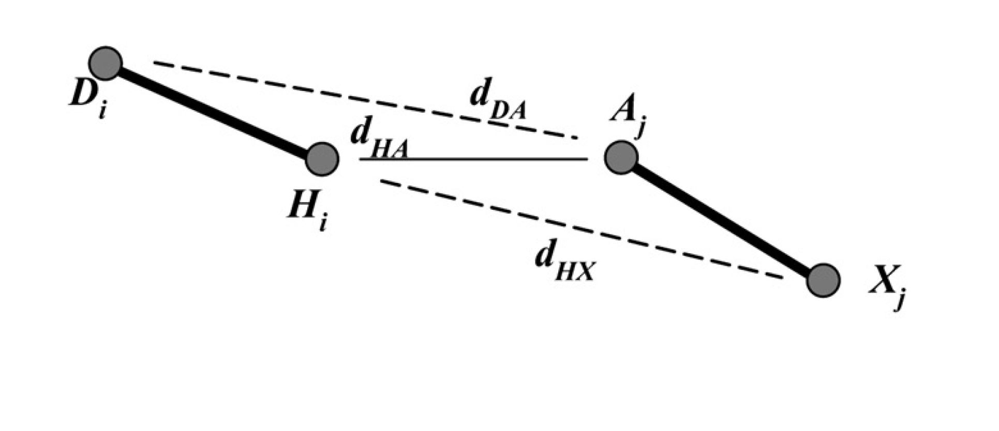

*Figure 3-5 Hydrogen bond structure of all-atom model. H<sub>i</sub> is the
hydrogen atom; A<sub>j</sub> is the acceptor and could be different types of atom;
D<sub>i</sub> is the donor and X<sub>j</sub> is the heavy atom directly bonded to A<sub>j</sub>. The
thick solid lines indicate the covalent bonds between the atoms; the
thin solid lines indicate the hydrogen bond; the dashed lines indicate
the auxiliary bonds for helping maintain the hydrogen bond orientation.*
<br><br>

By adjusting the type of A<sub>j</sub> atom, the hydrogen bond can be formed
between backbone-backbone, backbone-side chain, and side chain-side
chain. The donors include backbone amide hydrogen atoms and side chain
polar hydrogen atoms of His, Trp, Tyr, Asn, Gln, Arg, and Lys. The
acceptors include backbone carbonyl oxygens, side chain oxygen of Asp,
Glu, Ser, Thr, and Tyr, and the side chain nitrogen of His.

The mechanism to model the hydrogen bond forming and breaking is similar
to the coarse grained model: once the hydrogen, H<sub>i</sub>, and the acceptor,
A<sub>j</sub>, reach the interaction, the distances between 
H<sub>i</sub>X<sub>j</sub> and D<sub>i</sub>A<sub>j</sub>, which
define the orientation of the hydrogen bond, will be evaluated; the
total potential energy change, ΔE, between H<sub>i</sub>/A<sub>j</sub> and other surrounding
atoms are also evaluated before and after the putative hydrogen bond
formation; if these distances satisfy the preset range, and the total
kinetic energy is enough to overcome the potential energy change, ΔE,
the hydrogen bond will be allowed to form, and forbad otherwise; after
the formation of hydrogen bond, the atoms H<sub>i</sub> and A<sub>j</sub>
will become H<sub>i</sub>' and
A<sub>j</sub>', respectively, and they will interact with other atoms by using the
new pairs of potential.

**Interactions**
----------------

Here will describe the basic algorithms behind the DMD simulation. It
will also give a talk about the mechanisms in energy minimization, wall
interaction, and REMD.

### **Algorithms**

This appendix will describe how DMD works.

Assume we have two particles, *i* and *j*, each with diameter *sigma*. The
coordinates of the particles are the vector
*vector_r<sub>i</sub>* = [x<sub>i</sub>,y<sub>i</sub>,z<sub>i</sub>] = 
*vector_r<sub>j</sub>* = [x<sub>j</sub>,y<sub>j</sub>,z<sub>j</sub>]
and they have velocity vector *vector_v<sub>i</sub>* and
*vector_v<sub>j</sub>*. The collision event and collision time can
be determined by using the relative position and relative velocity,
*vector_r<sub>ij</sub>* and *vector_v<sub>ij</sub>*.

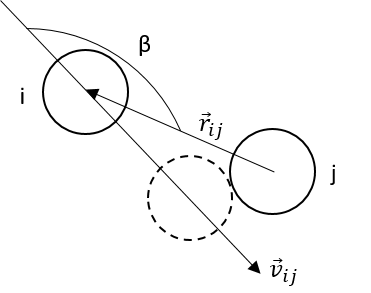

*Figure 3-6 Sample System (2D)*
<br><br>

A collision event is dependent of whether the distance between particles
*i* and *j* will become equal to the average molecular dimeter
*sigma<sub>ij</sub> = (sigma<sub>i</sub> + sigma<sub>j</sub>) / 2* sometime
in the future. Using superscript "o" to represent an initial condition,
the relative position vector at any time in the future is found by the
following equation,

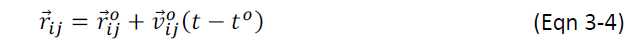

So if *vector_r<sub>ij</sub>* and
*vector_v<sub>ij</sub>* have opposite sense, the particles
will be approaching and a collision is possible. We may check to see if
the dot product
*vector_r<sub>ij</sub> ∙ vector_r<sub>ij</sub>*
becomes equal to sigma<sub>ij</sub><sup>2</sup> in the future at some time
increment *(t - t<sup>o</sup>)*,

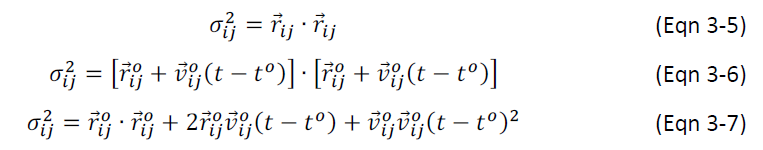

Here we define a variable *b<sub>ij</sub>* as a dot product,


If *b<sub>ij</sub>* > *0*, the relative position
|*vector_r<sub>ij</sub>*| will be increasing
with time. The two particles will be further away with each other. If
*b<sub>ij</sub>* = *0*, the relative velocity and relative position vectors
are perpendicular. If *b<sub>ij</sub>* < *0*, the relative position
|*r<sub>ij</sub>*| will be decreasing and there may be a
collision. So after removing the superscript "o" on
*vector_r<sub>ij</sub>* and
*vector_v<sub>ij</sub>*, E can be rewritten as follows,

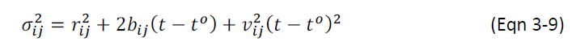

or


Solving for time increment by using the quadratic formula, we can have,


where *s_<sub>time</sub> = +/- 1*. The discriminant,
*b<sub>ij</sub><sup>2</sup> - v<sub>ij</sub><sup>2</sup>(r<sub>ij</sub><sup>2</sup> - sigma<sub>ij</sub><sup>2</sup>)*,
in *Eqn 3-11* has to be non-negative for a collision to occur. If it is negative,
then the particles will miss each other. The smaller real root
*s<sub>time</sub> = - 1* is used for the solution to the
quadratic as shown in Figure. The smaller real root occurs when the
particles collide at *vector_r<sub>j</sub><sup>s-</sup>*. The location
labeled *vector_r<sub>j</sub><sup>s+</sup>* is the root that will not occur
physically.

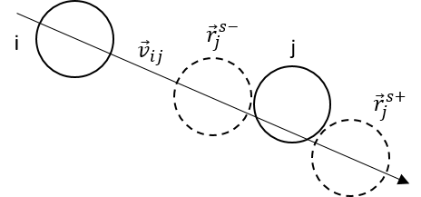

*Figure 3-7 Only the smaller real root,*
*s<sub>time</sub> = - 1 is used.*
<br><br>

If the particle has a potential shell (See Figure), the equation for the
event time can be modified to,


where *d<sub>ij</sub>* is the actual distance of centers for the event.

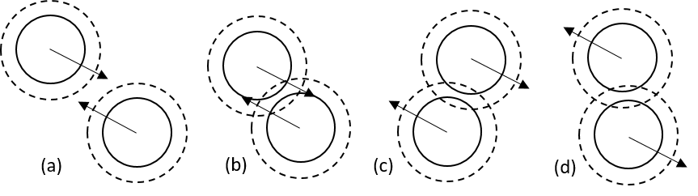

*Figure 3-8 (a) Approaching particles that will enter the potential
shell; (b) particles in the shell that will have a hard sphere
collision; (c) particles in the shell that will miss a hard sphere
collision, but experience a potential l change event after they pass;
(d) particles moving away that will experience a potential change event
at the shell boundary.*
<br><br>

Calculation of velocity changes upon an event will be a little more
complex. We use prime (') to denote the state after the event. The
change in potential energy for the event is indicated by
*Δepsilon = epsilon' - epsilon*, which may
be zero, positive or negative depending on whether it is a hard sphere
collision, or particles enter or escape from a potential shell.

Total energy is conserved upon an event between particles *i* and *j*,

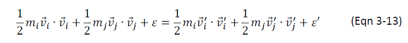

which can be rearranged,

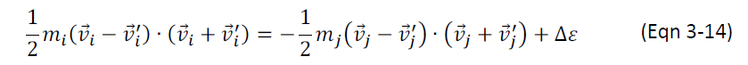

When the two particles contact, the relative position will be,

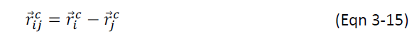

The change in momentum for an event is proportional to the collision
vector *vector_r<sub>ij</sub><sup>c</sup>*,

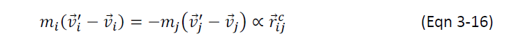

or

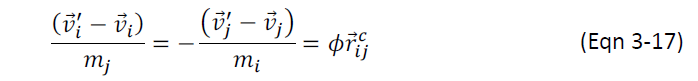

*phi* is the parameter we will try to determine. Insert *Eqn 5-14* into
*Eqn 5-11*,

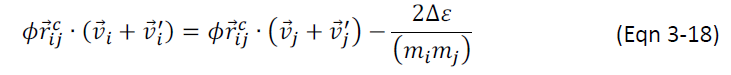

Rearrange *Eqn 5-14* also leads to,

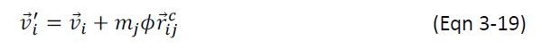

and

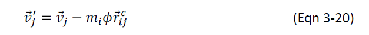

Plugging *Eqn 5-16* and *Eqn 5-17* into *Eqn 5-15* to eliminate the
primed variables,

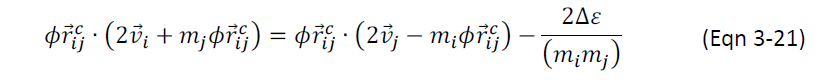

Define
*d<sub>ij</sub><sup>2</sup> = vector_r<sub>ij</sub><sup>c</sup>* ∙ vector_r<sub>ij</sub>*<sup>c</sup>*,
*vector_v<sub>ij</sub> = vector_v<sub>i</sub> - vector_v<sub>j</sub>*
and
*b<sub>ij</sub>*<sup>c</sup> = vector_r<sub>ij</sub>*<sup>c</sup> ∙ vector_v<sub>ij</sub>*,
and rearrange *Eqn 5-18*,

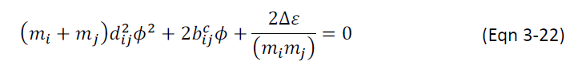

Applying the quadratic formula,

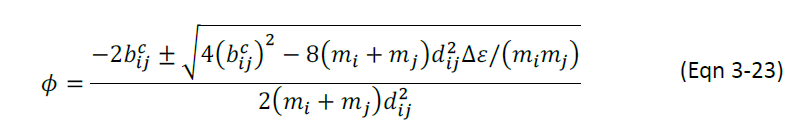

Define the reduced mass, 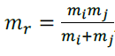
,
then,

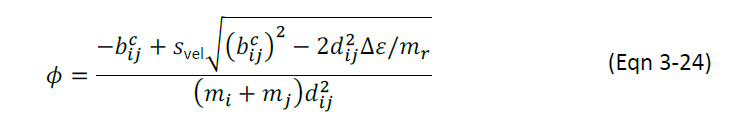

where the sign of *s<sub>vel</sub>* depends on the context of
the event (See *Figure 3-9*). For an event where
*Δepsilon* = *0*, *s<sub>vel</sub>* = *- 1* is the
only reasonable solution. For a hard sphere collision event, the
distance is the inter-particle radius,
*d<sub>ij</sub>* = *sigma<sub>ij</sub>* and the relation becomes,


Based on the context of the event, the DMD calculation will follow the
flowsheet below,

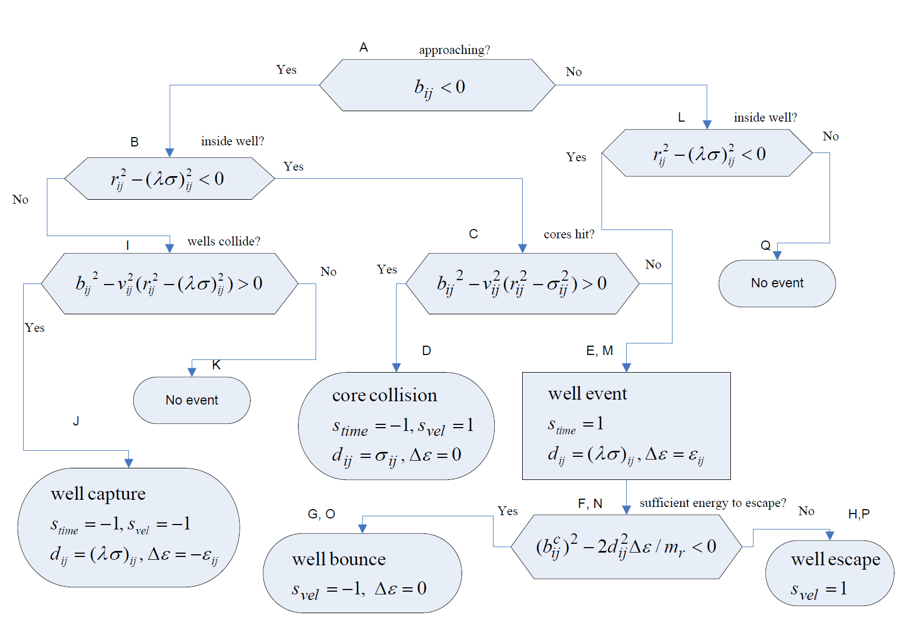

*Figure 3-9 Flowsheet for DMD with wells.<sup id="c39">[9](#c39)</sup>*
<br><br>

### **Energy Minimization**

Theoretically, the sDMD can import any PDB file of proteins to create
the simulation system. In the PDF file, the original coordinates of
atoms may violate the ranges of bond lengths or the minimum distances
between pairs of atoms in the sDMD's library. To eliminate these
conflicts, the sDMD uses steepest descent algorithm.

In DMD, the potential function is a step function, then the first-order
derivative would not be possible. However, by computing the relative
positions of a pair of atoms, we could obtain the vectors that can guide
the atoms to move closer or further; based on their distance, then, we
can find at which step the potential currently locates, as well as to
which direction the potential will decrease. From these information, we
can decide the next move of an atom to approach the local minimum of
potential energy.

In practice, to achieve a fast energy minimization, the sDMD will only
eliminate the bond length violations and atom diameter overlapping. In
other words, the program will only vibrate an atom if it has bond that
was too short or too long and if it overlaps any surrounding atoms. User
can follow a short simulation under a low temperature to further relax
the system.

### **Confined Walls**

The sDMD is able to simulate a system in various types of confined
environments, such as parallel pores, cylindrical tubes, and spherical
cavities. Currently the confined walls can be only smooth surfaces,
which means there are no explicit atoms on the walls. The wall surface
is like a multi-layer shell, and each layer represents a potential step.
Or we can image the wall is made of extremely high density of atoms, so
high that the other atoms interact with it will be like interacting with
a smooth surface.

To simulate the parallel pores is very straightforward: once the
positions of the walls are set, the event time in the nearest future
when an atom interact with the wall can be easily determined, and the
after-interaction velocity can be computed directly, since it is just a
one-dimension problem. However, for a cylindrical tube or a spherical
cavity, the situation will become a little bit more complex. Due to the
curvature of surface and the implicit atoms, it would be difficult to
determine the exact direction and position on the wall at which the atom
will interact at the nearest event, which both are required to compute
the interaction potential and after-interaction velocity change. To deal
with this issue, the sDMD uses an indirect way: it is easy, instead, to
compute the instant distance of an atom from the center of either a
cylinder tube or a spherical cavity, L. Then the distance between the
atom and the wall will be D = R - L, where R is the diameter of the
tube or cavity. Thus, the potential range in the potential step can be
determined by D. Next, instead of doing a lot of trigonometric
calculations or trying to find a pseudo-atom on the wall to model the
interaction with the target atom, the sDMD consider this as an event of
interaction between the target atom and a huge pseudo-atom at the center
of the tube or cavity. In other words, any interactions between an atom
and the wall will be like an atom inside another huge atom interacts
internally with the shell of the huge atom. The interaction types will
be switched. For example, the well-capture event corresponding to an
atom and the center pseudo-atom will become a well-escape event
corresponding the atom and the wall, and similarly, the hard-sphere
collision event will become a well-bounce, etc. Thus, the sDMD could use
the same algorithm to compute the interaction between a pair of atoms
and between atom and wall.

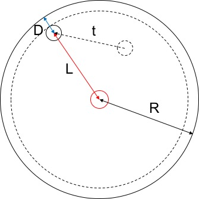

*Figure 3-10 Schematic diagram of wall interaction in a cylindrical tube
or a spherical cavity. The big solid circle is the wall boundary, which
is infinitely repulsive; the big dashed circle is the potential shell of
wall. The small black dashed circle is the original position of the
target atom; the small black solid circle is the future position of the
target atom after time t. The small read circle is the pseudo-atom at
the center. The black line is the diameter of the wall, R; the red line
is the distance between the target atom and the pseudo-atom, L; the blue
line is the distance between the target atom and the wall, D = R - L.*
<br><br>

The sDMD also allows users to use the obstruction wall. The obstruction
wall is an infinite wall parallel to the *xy-*, *xz-* or *yz-* planes. Multiple
obstruction wall can be inserted into the system box at any positions.
This can be used to construct close-end cylindrical tubes, cuboid
confined environments, and tunnel and reservoirs (combined with tunnel
function), see Figure 3-11, or divide the system box into different
regions.

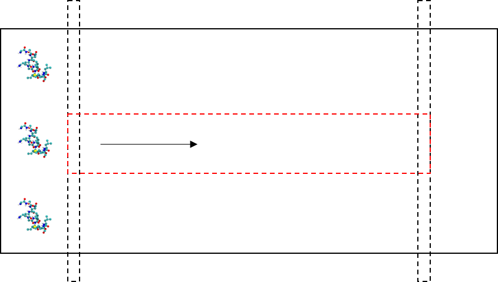

*Figure 3-11 Combination of obstruction walls and cylindrical tube
confinement can create a tube between two reservoirs, which can be used
to model protein translocations. The solid rectangle represents the
boundary of the system box; the black dashed rectangles represent the
obstruction walls; the red dashed rectangle represents the cylindrical
tube.*
<br><br>

### **Replica Exchange Molecular Dynamics Simulation (REMD)**

The sDMD allows users to use REMD. The results can be analyzed by
T-WHAM<sup id="c310">[10-11](#c310)</sup> in the analysis executable.

REMD can be used to efficiently explore the potential energy landscape
of molecular systems. The ruggedness and the slope toward the energy
minimum in the landscape govern sampling efficiency at a given
temperature. Although escape out of local minima is accelerated at
higher temperatures, the free energy landscape is altered due to large
entropic contributions. To efficiently overcome energy barriers while
maintaining conformational sampling corresponding to a relevant free
energy surface, the sDMD employs the replica exchange sampling
scheme<sup id="c38">[8](#c38)</sup><sup>,</sup><sup id="c312">[12-13](#c12)</sup>.

In REMD, multiple simulations/replicas of the same system are performed
in parallel at different temperatures. Individual simulations are
coupled through Monte Carlo-based exchanges of simulation temperatures
between replicas at periodic time intervals. Temperatures are exchanged
between two replicas, *i* and *j*, maintained at temperatures T<sub>i</sub> 
and T<sub>j</sub> and
with energies E<sub>i</sub> and E<sub>j</sub>, according to the canonical Metropolis criterion
with the exchange probability *P*$, where *P* = *1* if
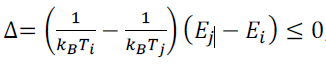,
and *P* = *e<sup>-Δ</sup>*, if *Δ* > *0*. To achieve
this, the sDMD uses a Socket server to send and receive the temperature
and energy data between pairs of replicas at the preset time intervals.
The sDMD would suggest the exchange rate to be every 1 x 10<sup>3</sup> time
units.


<br><br>
*Reference*

<b id="c31">[1]</b> Voegler Smith, A.; Hall, C. K., alpha-helix formation: discontinuous
molecular dynamics on an intermediate-resolution protein model.
*Proteins* **2001,** *44* (3), 344-60.[↩](#c31)

<b id="c31">[2]</b> Voegler Smith, A.; Hall, C. K.,
Bridging the gap between homopolymer and protein models: A discontinuous
molecular dynamics study. *The Journal of Chemical Physics* **2000,**
*113* (20), 9331-9342.[↩](#c31)

<b id="c31">[3]</b> Smith, A. V.; Hall, C. K., Assembly of a
tetrameric alpha-helical bundle: computer simulations on an
intermediate-resolution protein model. *Proteins* **2001,** *44* (3),
376-91.[↩](#c31)

<b id="c31">[4]</b> Smith, A. V.; Hall, C. K., Protein refolding versus
aggregation: computer simulations on an intermediate-resolution protein
model. *J Mol Biol* **2001,** *312* (1), 187-202.[↩](#c31)

<b id="c35">[5]</b> Buldyrev, S. V.,
Application of Discrete Molecular Dynamics to Protein Folding and
Aggregation. In *Aspects of Physical Biology: Biological Water, Protein
Solutions, Transport and Replication*, Franzese, G.; Rubi, M., Eds.
Springer Berlin Heidelberg: Berlin, Heidelberg, 2008; pp 97-131.[↩](#c35)

<b id="c36">[6]</b> S. Takada, Z. L.-S., P. G. Wolynes, Folding dynamics with nonadditive
forces: A simulation study of a designed helical protein and a random
heteropolymer. *J. Chem. Phys.* **1999,** *110* (23), 11616-11629.[↩](#c36)

<b id="c37">[7]</b> Andersen, H. C., Molecular dynamics simulations at constant pressure
and/or temperature. *The Journal of Chemical Physics* **1980,** *72*
(4), 2384-2393.[↩](#c37)

<b id="c38">[8]</b> Ding, F.; Tsao, D.; Nie, H.; Dokholyan, N. V., Ab
initio folding of proteins with all-atom discrete molecular dynamics.
*Structure* **2008,** *16* (7), 1010-8.[↩](#c38)

<b id="c39">[9]</b> Elliott, J. R.; Lira, C. T.,
Supplement. In *Introductory chemical engineering thermodynamics*, 2nd
ed.; Prentice Hall: Upper Saddle River, NJ, 2012.[↩](#c39)

<b id="c310">[10]</b> Kumar, S.;
Rosenberg, J. M.; Bouzida, D.; Swendsen, R. H.; Kollman, P. A., THE
weighted histogram analysis method for free-energy calculations on
biomolecules. I. The method. *Journal of Computational Chemistry*
**1992,** *13* (8), 1011-1021.[↩](#c310)

<b id="c310">[11]</b> Gallicchio, E.; Andrec, M.; Felts, A.
K.; Levy, R. M., Temperature weighted histogram analysis method, replica
exchange, and transition paths. *J Phys Chem B* **2005,** *109* (14),
6722-31.[↩](#c310)

<b id="c312">[12]</b> Zhou, R.; Berne, B. J.; Germain, R., The free energy
landscape for beta hairpin folding in explicit water. *Proc Natl Acad
Sci U S A* **2001,** *98* (26), 14931-6.[↩](#c312)

<b id="c312">[13]</b> Okamoto, Y.,
Generalized-ensemble algorithms: enhanced sampling techniques for Monte
Carlo and molecular dynamics simulations. *J Mol Graph Model* **2004,**
*22* (5), 425-39.[↩](#c312)
<br><br><br>

**Program Structure**
=====================

This section will briefly describe the structure of the program.

struct AtomStr{} is the most important data structure in the sDMD. It
stores almost all the information of an individual atom.

```C
struct AtomStr {
    struct PropertyStr *property;
    struct DynamicStr *dynamic;
    struct EventListStr *eventList;
};
```

"property" stores all the static information, like mass and atom number;
"dynamic" stores all the dynamic information, like coordinate and
velocity; "eventList" stores the position of this atom in the search
binary tree, as well as its parent and children.

The sDMD has been optimized by the Pthreads Library for the future
development of parallel computing. The program will establish
single/multiple threads and each of the thread can perform the
calculation by its own. Thus, the data in the sDMD have two layers, one
is the raw data and the other is the data copy in each thread. *Figure4-1* 
shows a diagram of a single-core simulation.

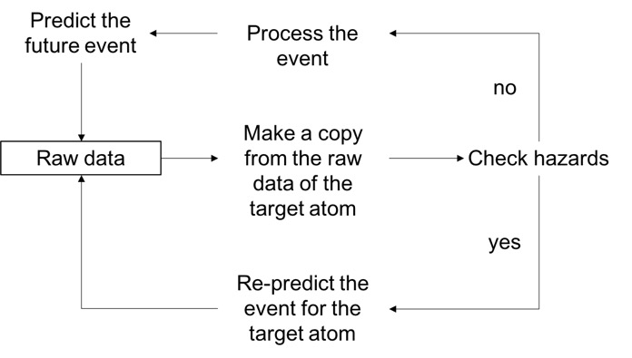

*Figure 4-1 Single-core simulation process*
<br><br>

At the beginning of a simulation, the thread will be assigned a target
atom whose event is in the nearest future. If the target atom's event is
an interaction event, the thread will be also assigned a partner atom
with which the target atom will interact. The thread will make a copy of
the data of these atoms and do the following calculations by only using
this copy. After the event being processed, the thread will further
predict the next possible event for this target atom. During this whole
process, the raw data will not be affected. Before committing the
processed data and the predicted information to the raw data, the
program will check the hazards. The hazard here means any situations
that would make the previously predicted event outdated. In other words,
if there exists any hazard, the processed event by the thread will be
invalid. If this is the case, the thread will re-calculate the next
event for the target atom or, in some cases, would be assigned by
another target atom and do the same calculations. Only if there exists
no hazard, the calculated results will be committed to the raw data.

The sDMD will keep looping the above processes until the assigned
simulation time is reached.

**Program Usage**
=================

**Installation**
----------------

The package includes three folders: simulation source code folder,
*src*, analysis source code folder, *analysis*, and an *input* folder.
Each source code folder has its dedicated Make file, *Makefile*. The
*input* folder contains the configuration file, *parameter.txt*, and the
force filed library folder, *Library*.

To compile the simulation source code, use the following command,

```bash
$ make all
```

It will generate three executables, *sDMD*, *sServer*, and *sREMD*. *sDMD* is
the core program to run the simulation; *sREMD* is the program to launch
REMD simulation, only; *sServer* is an assistant program to create a
socket server for REMD simulation, and will be executed by sREMD
automatically.

If users only need the core program to run regular DMD simulations,
which only the sDMD executable will be required, simply use the command,

```bash
$ make sDMD
```

To compile the analysis source code, use the following command,

```bash
$ make
```

It will generate only one executable, analysis.

**Run Parameters**
------------------

### **Non-REMD simulation**

sDMD will need a coordinate file, *\*.gro* or *\*.pdb*, the configuration
file, parameter.txt, and the force field library folder, *Library*, to
start a simulation.

Below is an example of the configuration file,

```txt
Continue?            new
Time                 50
T(reduced)           0.65
Dump_Rate            10
CutOff_R(A)          9.0
Force_Field          Ding
Thermostat           Andersen
PDMD_Method          1
ThreadNo             1
WallExist?           no
WallType             sphere
WallDyn              no
Flow(x,y,z)          0.025 0.0 0.0
Obstruct? 2,         60.0 0.0 0.0, 120.0 0.0 0.0
Tunnel?              60 120 25
```

**Item**        | **Description**
--------------- | ----------------
continue?       | If users would like to perform a new simulation, use "new"; if users would like to restart a previous run, which may have not finished yet, or would like to extend the current simulation, use "continue". Both process will back up the old files. The backup files will have a suffix representing the backing up time and date.
Time            | Simulation time.
T(reduced)      | Reduced system temperature, *T\** = *T* / 502 K. If set to "no", the program will keep using the temperature set at the last time.
Dump\_Rate      | How often the data will dump. Here is each 10 time units.
CutOff\_R(A)    | The cutoff radius of VDW interaction. Unit is A.
Force\_Field    | The force field employed in the simulation. Currently only support "Ding"<sup id="c51">[1](#c51)</sup>.
Thermostat      | The thermostat algorithm. Currently only support "Andersen"<sup id="c52">[2](#c52)</sup>.
PDMD\_Method    | Parallel algorithm. Currently only support "1", which means only one CPU core will be used.
ThreadNo        | Number of cores employed to perform the parallel computing. Currently only support "1".
WallExist?      | If users would like to perform a simulation under bulk conditions, use "no". If users would like to perform a simulation in confined environments, use "smooth".
WallType        | Shape of the wall. Support "parallel", "cylinder", and "sphere".
WallDyn         | If the confined walls are fixed, use "no". If the confined walls are dynamic, use "compress", "extend", or "repulse".
Flow(x,y,z)     | If there will be constant velocities applied on the atoms. Each on *x-*, *y-*, and *z-* axis.
Obstruct?       | If there exists any obstruction walls in the system. If no, use "no". Otherwise, the first number represents how many of the obstruction walls will be inserted into the system, following the position set of each obstruction wall on *x-*, *y-*, and *z-* axis, separating by commas.
Tunnel?         | If there will be a tunnel in the system. This is only used for the translocation simulation. If no, use "no". Otherwise, the three numbers represent, respectively, the start coordinate, the end coordinate and the diameter of the tunnel. These coordinates are all on x-axis and the unit is A.
<br>

To run the executable sDMD, use the following command,

```bash
$ ./sDMD [FLAGS]
```

Use the flag *-h* or *-help* to show the supported *FLAG*s,

**Flag**        | **Description**
------- | --------
-i                                | directory of the parameter folder
-o                                | directory of the output folder
-f                                | (optional) follow the file name of the input coordinate file
-si                               | (optional) follow the file name of the input saved data for continuity
-so                               | (optional) follow the file name of the output saved data for continuity
-trj                              | (optional) follow the file name of the output trajectory file
-cnt                              | (optional) follow the file name of the output connection map
-log                              | (optional) follow the file name of the output Log file 
-sys                              | (optional) follow the file name of the output SysInfo file
-pot                              | (optional) output potential energy, follow the file name, otherwise will use the default name
-kin                              | (optional) output kinetic energy, follow the file name, otherwise will use the default name
-tem                              | (optional) output temperature, follow the file name, otherwise will use the default name
-HBn                              | (optional) output hydrogen bond number, follow the file name, otherwise will use the default name
-xyz                              | (optional) output xyz trajectory, follow the file name, otherwise will use the default name
-pdb                              | (optional) output pdb trajectory, follow the file name, otherwise will use the default name
-box                              | (required only if the coordinate file is a .PDB file) the simulation box dimensions, x, y, z
-Wsz                              | (required only if WallDyn is assigned) follow the maximum changing size of the wall, default 5 A
-Wrt                              | (required only if WallDyn is assigned) follow the total time needed for the size change, default 200                       |
-REMD                             | only use during REMD, follow the server name, the port number, the temperature, the exchange rate, <br>and the suffix name of saving files <br>(this flag will be set automatically by REMD executable)
<br>

### **REMD Simulation**

Besides the required files and commands mentioned above, to run a REMD
simulation, the sDMD needs another configuration file, *REMDConf.txt*,
and the other two executables, *server* and *REMD*. The configuration file
must be in the *input* folder and the two executables must be in the
same folder of executable *sDMD*. The *T(reduced)* item should be set to
"no".

Below is an example of the configuration file (the first line is just a
comment),

```txt
#REPLICA EXCHANGE MD CONFIGURATION FILE
ReplicaNum = 3
Temperatures = 275 350 450
SocketPort = 20202
ExchangeRate = 50
```

**Item**        | **Description**
----------   | ----------
ReplicaNum   | The number of replicas.
Temperatures | The temperature of each replica.
SocketPort   | The port number of the socket server.
ExchangeRate | How often the temperature will be exchanged. Unit is the time unit.
<br>


To run the executable *REMD*, use the following command,

```bash
$ ./REMD [distribute T or not] -f [configuration file]
         -args [args of executable without flag -REMD]
```

**Flag**        | **Description**
------------ | ---------
-nodist      | [yes] Default is yes, if absent. Otherwise, the program will NOT distribute the preset <br>temperature to each replica. Use this flag if users would like to extend/restart the simulation.
-f           | follow the file name of the REMD configuration file
-args        | flags used in each individual replica
<br>

The flags of executable server and the *-REMD* flag of executable *sDMD*
will be set by *REMD* automatically.

### **Analysis**

To perform an analysis, use the following command,

```bash
$ ./analysis [FLAGS]
```

Use the flag *-h* or *-help* to show the supported *FLAG*s,

**Flag**        | **Description**
----------- | -----------
-path       | exact path of data folder
-trj        | trajectory input file
-cnt        | connect map input file
-sys        | (optional) system info input file
-log        | (optional) log input file
-sum        | (optional) ignore the old time record in .log file
-rPBC       | remove PBC, call at the beginning. require -trj input file
-HB         | analyze HB info. require -cnt input file
-En         | analyze energy info
-Ag         | analyze aggregation info
-RG         | calculate RG (not support yet)
-MSD        | calculate MSD (not support yet)
-Ramach     | (require -HB) plot Ramachandran plots for each amino acid
-ConMap     | (require -HB) plot contact maps for atoms and amino acids
-REMD       | analyze REMD data. follow the flags below:
-reNo       | number of replicas
-bin        | (optional) number of bins in histogram. default 10
-aHB        | (optional) use alpha HB number as the reaction coordinate
-bHB        | (optional) use beta HB number as the reaction coordinate
-tHB        | (optional) use total HB number as the reaction coordinate
-maxE       | (optional) max value of potential energy (most negative). default -150
-minE       | (optional) min value of potential energy (least negative). default 0
-temp       | (optional) target temperature. default 300
-st         | (optional) start frame of analyzing. default 0
-et         | (optional) end frame of analyzing. default -1 (the final frame)
<br>

The analysis program is also highly modularized and optimized. It will
be easy to add more analysis functions onto it.


<br><br>
*Reference*

<b id="c51">[1]</b> Ding, F.; Tsao, D.; Nie, H.; Dokholyan, N. V., Ab initio folding of
proteins with all-atom discrete molecular dynamics. *Structure*
**2008,** *16* (7), 1010-8.[↩](#c51)

<b id="c52">[2]</b> Andersen, H. C., Molecular dynamics
simulations at constant pressure and/or temperature. *The Journal of
Chemical Physics* **1980,** *72* (4), 2384-2393.[↩](#c52)
<br><br><br>

**Format**
==========

**Coordinate File**
-------------------

The sDMD supports *.pdb* and *.gro* files as the coordinate input file. But
it recommends to use a *.gro* file as the coordinate file, since the *.pdb*
file has too many alternative formats.

When the sDMD imports the coordinate file, it will first read the
original *.pdb* or *.gro* file. During this process, the program will remove
the atoms those are not in the model library, such as the light
hydrogens and one of the carboxylic oxygen on the tail amino acid. At
the same time, the program will extract the atom information and assign
them onto the variables about protein/peptide, amino acid and atom.
After read through the whole coordinate file, some data will be dumped
into a *.xyz* file. The program will then read the *.xyz* file in order to
finish the final assignments for some other variables. The reason of
such a process is that some of the variables can be correctly assigned
only after reading through and modifying the original coordinate file.

The output trajectory file will be of *.gro* format. It consists of
multiple continuous snapshots of the atoms' coordinates.

### **GRO File**

Pay attention that the coordinate unit of *.gro* file is nm. The length
unit in the sDMD, however, is A. The program will convert the unit
automatically.

The following is an example of the *.gro* file,

```txt
model
  375
    1ASP      N    1   1.110   2.333   3.994
    1ASP     CA    2   1.234   2.331   3.919
    1ASP      C    3   1.207   2.279   3.778
    1ASP      O    4   1.143   2.175   3.761
    1ASP     CB    5   1.337   2.238   3.984
    1ASP     CG    6   1.284   2.100   4.023
    1ASP    OD1    7   1.196   2.095   4.111
    1ASP    OD2    8   1.333   2.002   3.964
    2ALA      N    9   1.256   2.353   3.680
    2ALA     CA   10   1.237   2.315   3.540
    2ALA      C   11   1.370   2.330   3.467
    2ALA      O   12   1.476   2.292   3.519
    2ALA     CB   13   1.128   2.403   3.479
    2ALA      H   14   1.308   2.439   3.696
    3GLU      N   15   1.363   2.383   3.346
    3GLU     CA   16   1.482   2.402   3.264
    …
   7.00000   7.00000   7.00000
```

The first line is a comment, can be a brief description of the file.
Only one line of comment will be allowed.

The second line has only one number represents the total atom number in
the system. In this example it has 375 atoms. To save pages it does not
show them all.

The line after the second contains the information of each atom. Use the
line below as an example,

```txt
    2ALA     N    9    1.256 2.353 3.680
```

The first term describes at which amino acid in a protein/peptide the
atom locates. Here is the second amino acid whose name is "ALA". Pay
attention that the amino acid number here is not continuous between
molecules, which means that if there are multiple molecules in the
system, this number will start from 1 for each molecule. This will help
the program to judge how many molecules there are in the system. The
second term is the atom's name. The third term is the number of the atom
in the whole system. This number is continuous in the whole system. The
following three terms are the atom's coordinates on *x-*, *y-* and *z-* axis,
respectively. If this is a output *.gro* file from the simulation, there
will be three more terms following the coordinates. They are the atom's
velocities on *x-*, *y-* and *z-* axis, respectively.

The three numbers on the last line of the *.gro* file are the sizes of the
system box, on *x-*, *y-* and *z-* axis, respectively.

### **PDB File**

The following is an example of the supported *.pdb* file,

```txt
REMARK    THIS IS A SIMULATION BOX
CRYST1  150.000  150.000  150.000  90.00  90.00  90.00 P 1        1
ATOM      1  N   ASP X   1      60.227  61.745  83.465  0.00  0.00            
ATOM      2  CA  ASP X   1      61.467  61.725  82.715  0.00  0.00            
ATOM      3  C   ASP X   1      61.197  61.205  81.305  0.00  0.00            
ATOM      4  O   ASP X   1      60.557  60.165  81.135  0.00  0.00            
ATOM      5  CB  ASP X   1      62.497  60.795  83.365  0.00  0.00            
ATOM      6  CG  ASP X   1      61.967  59.415  83.755  0.00  0.00            
ATOM      7  OD1 ASP X   1      61.087  59.365  84.635  0.00  0.00            
ATOM      8  OD2 ASP X   1      62.457  58.435  83.165  0.00  0.00            
ATOM      9  N   ALA X   2      61.687  61.945  80.325  0.00  0.00            
ATOM     10  CA  ALA X   2      61.497  61.565  78.925  0.00  0.00
…
END
```

The *.pdb* file can have several lines of comments/descriptions at the
head. The useful information is on the line with the keyword "ATOM" in
front. Use the following line as an example,

```txt
ATOM      9  N   ALA X   2      61.687  61.945  80.325  0.00  0.00            
```

The first term is the keyword. The second term is the number of the atom
in the whole system, which is continuous. The third term is the atom's
name. The fourth term is the amino acid name at which the atom locates.
The fifth term is just an arbitrary symbol for the protein molecule. The
atoms in the same molecule will have the same symbol. Different
molecules can share the same symbol, but not the continuous two. The
sixth term is the amino acid's number in the protein. This number is not
continuous between different molecules. The following three terms are
the atom's coordinates on *x-*, *y-* and *z-* axis, respectively. The sDMD will
ignore all the terms behind.

To import from the coordinate file of a *.pdb* format, users need to
specify the box size by using -box flag while executing sDMD.

**Force Field File**
--------------------

The force field consists of two types of files. One contains the
parameters of amino acid and the other contains the potential table.

### **Parameters of amino acid**

There are 21 parameter files for each of the amino acid (PRO is not
supported yet). The file's name indicates which amino acid it
represents. Here use ALA.txt as an example,

```txt
RESIDUE ALA
   ATOM N      NZB    14.0  N N
   ATOM CA     CA1    12.0  N N
   ATOM C      CRB    12.0  N N
   ATOM O      OZB    16.0  N N
   ATOM CB     CA3    12.0  N N
   ATOM H      HB     12.0  N N
   BOND N      H      1.000 0.020
   BOND N      CA     1.458 0.020
…
  ANGLE CA     H      2.152 0.020
  ANGLE N      CB     2.460 0.012
…
  INTER CA     +N     2.425 0.014
  INTER C      +N     1.329 0.020
…
CONSTR2 C      +C     2.700 2.846 1.500 2.910 0.500 4.000
…
```

The first line is the name of the amino acid. The lines starting with
the keyword "ATOM" list all the atoms in this amino acid. Pay attention
that all the amino acids, except for "ALA" and "GLY", share the same
backbone characteristics, so for those amino acids the "ATOM" lines only
list their own dedicated atoms and the backbone data will be read from
*ALA.txt* directly. Use the following line as an example,

```txt
   ATOM CA     CA1    12.0  N N
```

The second term is the atom's name. The third term is the atom's type.
(All types of atoms can be find in *InteractionPotentialTable.txt* file
in the library.) The fourth term is the atom's mass. Pay attention that
the mass of hydrogen is set as 12.0, as the author suggests.<sup id="c61">[1](#c61)</sup> In some
cases this will have the hydrogen bond harder to form. In the sDMD, it
changes the mass back to 1.0. The user can disable it by changing the
source code, function *ScanAA* in *initialization.c*. The last two terms
are left for the further development. They can be assigned by any values
which can give the atom extra properties.

The lines starting with the keyword "BOND" list all the bonds in this
amino acid. Again, all the amino acids except "ALA" and "GLY" only list
their own dedicated bonds. Use the following line as an example,

```txt
   BOND N      H      1.000 0.020
```

This line means there is a covalent bond between atom N and atom H. The
bond length is 1.000 A and can vibrate between *1.0 x (1 - 0.02)* and
*1.0 x (1 + 0.02)*.

The format of the lines starting with the keywords "ANGLE" and "INTER"
are similar with "BOND" lines. They are however auxiliary bonds. The "+"
symbol in front of the atom name means this atom locates in the next
amino acid.

The line starting with the keyword "CONSTR" list all the dihedral
constraints in the amino acid. Use the following line as an example.

```txt
CONSTR2 C      +C     2.700 2.846 1.500 2.910 0.500 4.000
```

The number after the keyword "CONSTR" represents the number of steps
there will be in the potential function. The second and the third terms
are the head and tail atoms in the dihedral angle. Starting from the
fourth term are the values construct the potential function. The first
and the last values represent the minimum and the maximum distance
between the two atoms; the values in the middle are presented as pairs:
the first values are the discontinuity positions in the potential
function and the second values are the energy change crossing the steps.
In this example, the maximum distance is 4.000 A; when the two atoms
move closer than 2.910 A, the potential energy will decrease 0.500 kcal
/ mol, or become less negative by 0.500 kcal / mol; when they move even
closer than 2.846 kcal / mol, the potential energy will further decrease
1.500 kcal / mol. The distance between the two atoms cannot be smaller
than 2.700 A.

Currently the sDMD only allows to use one type of atom to construct the
wall. The atom used is listed in the file *Wall.txt*. The default is
"CA". Users can change it at will.

### **Potential Table**

There are two types of potential table: one is for VDW interaction,
called "InteractionPotentialTable.txt", and the other is for hydrogen
bond interaction, called *HBPotentialTable.txt*. They share the same
format and are similar to that used in "CONSTR" line. Any lines starting
with "\#" symbol are the comments. Use the following line from
*InteractionPotentialTable.txt* as an example,

```txt
HB   CA   2.000000 2.50000 0.20000 4.50000 0.02000 6.50000 0.01000
```

The first two terms represent the pair of atoms that holds the following
potential function. The only difference from the "CONSTR" line is that
there is no maximum distance, which means the number of values starting
from the third term is always odd, while in the "CONSTR" line is even.


<br><br>
*Reference*

<b id="c61">[1]</b> Ding, F.; Tsao, D.; Nie, H.; Dokholyan, N. V., Ab initio folding of
proteins with all-atom discrete molecular dynamics. *Structure*
**2008,** *16* (7), 1010-8.[↩](#c61)
<br><br><br>

**Functions**
=============

This section will briefly describe the core functions in the main source
code files. Most functions can be identified by their names.

**Simulation Source Code**
--------------------------

#### DMD.c

This file contains the main function.

#### DataSave.c

The functions in this file manage the naming, backing up, creating,
initializing, saving and closing of simulation files. All the saving
processes will call the function *SaveData()*.

#### Event.c

This file contains all the functions used to calculate the processes of
different events. The *DoEvent()* manages which event function will be
called. The events like collision, bonding, formation and breaking of
hydrogen bonds all will call *InteractionEvent()*. Hydrogen bonding also
has its own event function, *HBEvent()*. Other events all have their own
event functions: *ThermostatEvent()* for thermostat event,
*PBCandCrossCellEvent()* for period boundary crossing and cell crossing
event, *WallEvent()* for regular wall interaction event, *ObstEvent()* for
obstruction wall interaction event and *TunnelEvent()* for wall
interaction event in tunnel.

The function *LinkList()* manages the linked list between cells. To
increase the calculation speed, the sDMD divides a system box into many
cells and keeps tracking the cell number at which an atom locates. Thus,
by using the linked list between the atom number and cell number, it
will be easy to find which atoms are in the target cell. Combining the
linked list and the cut off radius, it will be easy and fast to scan the
27 cells surrounding the target atom by which its event can be
scheduled.

#### Initialization.c

The functions in this file are charged to read and import all the
configurations, parameters and coordinates. They will also allocate the
memory for most of the variables used during the simulation.

The functions are designed based on the formats of the force field.

#### List.c

This file contains the functions to manage the dynamic linked list.

#### Models.c

The functions in this file are used to convert the models' names (of
atoms and amino acids) into numbers.

#### REMD.c

The functions in this file are only used to perform the calculations for
just one replica in a REMD simulation. *REMD()* initializes the variables.
*REMDRun()* does the main jobs. *ReplicaExchange()* manages the data change
and *client\_open()* initialize a socket client for this replica.

There are two other files to create replicas and server, respectively.

#### SGThread.c

This is the core file to perform a single-core non-REMD simulation.
*SingleThread()* initializes the variables and *SingleThreadRun()* does the
main jobs.

#### ThreadProcess.c

The functions of the main procedures to perform a DMD simulation are in
this file. *FirstRun()* is only used when starting a fresh new simulation.
It will schedule the events for all the atoms and create a search binary
tree to manage the events. *ProcessEvent()* is used by the thread to
pre-calculate the event, by the function *DoEvent()*, and pre-predict the
future event, by the function *Predict()*. These two procedures will be
done only if there exists no hazard for the current event, checked by
the function *HazardCheck()*. Otherwise, the current event is invalid and
re-prediction will be performed. *CommitEvent()* is used to commit the
updated atom data to the raw data. *AssignJob()* is used to assign a
target atom to the thread and AssignThread() is used to update the data
of the thread for the assigned target atom.

#### TimePrediction.c

This file contains all the functions used to predict the event time.
Different events have their own time prediction functions. The function
name indicates the event type.

#### ToolFunctions.c

This file contains all the helper functions. The function FindPair() is
used to find the right potential step at which the target pair of atoms
locates. The *Scheduling()* functions help to manage the search binary
tree of events.

#### sREMD.c

This file is only used to perform the REMD simulation. It helps to
establish multiple replicas and import arguments and flags into the
executables sDMD and sServer.

#### sServer.c

This file is only used in the REMD simulation. It helps to create and
maintain a socket server for the data exchanging between replicas.

**Analysis Source Code**
------------------------

#### Analysis.c

This file contains the main function.

#### FileManage.c

The functions in this file help to assign names to files.

#### SystemInformation.c

The functions in this file are used to read the system information data
from the *.dat* file and *.log* file output from the simulation.

#### Cluster.c

The functions in this file are used to calculate the cluster evolution
during aggregation.

#### Energy.c

Th functions in this file are used to calculate the total kinetic
energy, *CalKeEnergy()*, and potential energy, *CalPoEnergy()*, of the
system, as well as the potential energy between the molecules and
confinement walls, *CalWlEnergy()*. *CalTemp()* is used to calculate the
system temperature, and *FindPair()* and *RightPair()* are used to find the
right potential step at which a pair of atoms locates.

#### HBRamach.c

The functions in this file are used to calculate the numbers of
different types of hydrogen bonds. *RamachandranPlot()* is used to compute
the Ramachandran plot. If the flag *-ConMap* is set, *HBInfo()* will also
produce the contact maps for both pairs of amino acids and pairs of
atoms.

#### PBCAdjust.c

The functions in this file are used to remove the period boundary
condition in the trajectory file.

#### REMD.c

The functions in this file are used to perform WHAM<sup id="c71">[1-2](#c71)</sup> analysis for
the results from REMD simulations.

#### Tools.c

This file contains all the helper functions.


<br><br>
*Reference*

<b id="c71">[1]</b> Kumar, S.; Rosenberg,
J. M.; Bouzida, D.; Swendsen, R. H.; Kollman, P. A., THE weighted
histogram analysis method for free-energy calculations on biomolecules.
I. The method. *Journal of Computational Chemistry* **1992,** *13* (8),
1011-1021.[↩](#c71)

<b id="c71">[2]</b> Gallicchio, E.; Andrec, M.; Felts, A. K.; Levy, R. M.,
Temperature weighted histogram analysis method, replica exchange, and
transition paths. *J Phys Chem B* **2005,** *109* (14), 6722-31.[↩](#c71)

<br><br><br>
